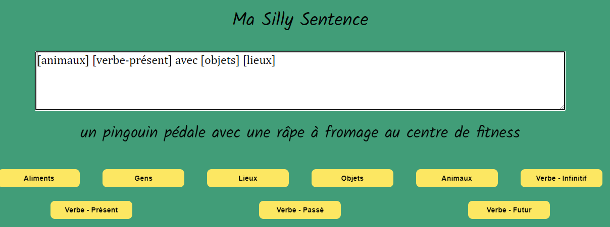

# My Port-folio Website

## Description
You are in the repository of my port-folio website.
The website looks like shit for now because I just wanted to see if it worked, and I'm focusing more on my studies projects. But I promise it will look better.
Its purpose is to present a few projects I've been working (and will work) on my learning path at Codecademy.
I started to learn how to code around 3 months ago.

Here is a pick of my last project (25/08/24):

**Copyright Notice**

All rights reserved. This work, including but not limited to software, documentation, and any other form of creative expression, is copyrighted material. 

For inquiries regarding permissions and licenses, please contact:

lauriane.bourree@gmail.com

[def]: ./silly-sentence-generator2.PNG